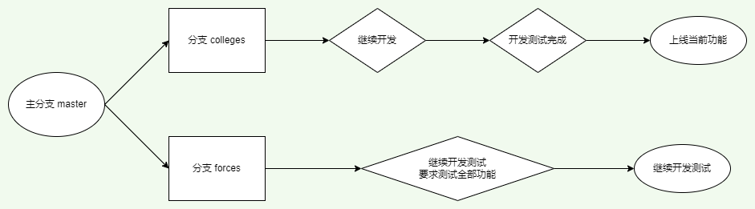
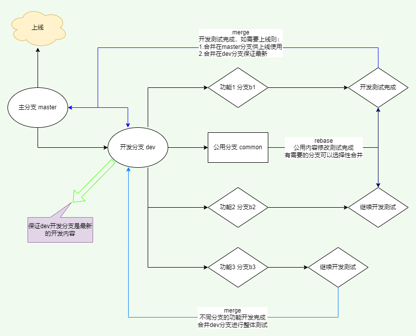

# Git 分支使用场景、方法

[toc]

## 使用场景

例 1：正在分支 `colleges` 开发功能 **高校定向生报名** ；同时在分支 `forces` 开发功能 **部队定向生报名**；高校定向生报名要求提起上线，并且其它功能不能开放；但是所有功能都要能在内部测试；

整理下思路：2 个功能同时在开发，要求上线其中一个功能，但是测试要全部都能看见并测试。

如图：

例 2：例 1 的基础上由于这 2 个模块要用一个 **选择代码的组件**，则建立了一个新的分支 `common-dictionary-level` 来开发一个公用的组件；如图：

## 使用方法

项目主要采取以 `master` 分支为主分支，包含：可以上线的内容；`dev` 分支为开发分支，包含：所有可测试的功能。在 `dev` 分支上创建各个模块所属分支进行开发，开发完成后合并到 `dev` 分支上，如果上线则同时合并在 `master` 分支上；如图：

## 命令说明

-   `Squash and merge` 把其它分支的修改合并到当前分支上；只生成一条合并记录；一般用来合并**普通分支**的修改内容。
-   `Rebase` 把其它分支的修改合并到当前分支上；完整合并修改记录；一般用来合并**公用分支**的修改内容。
