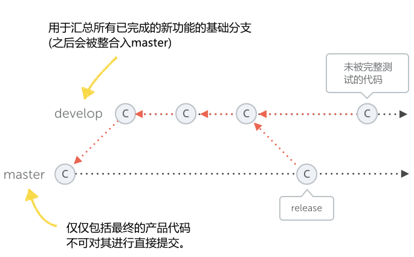
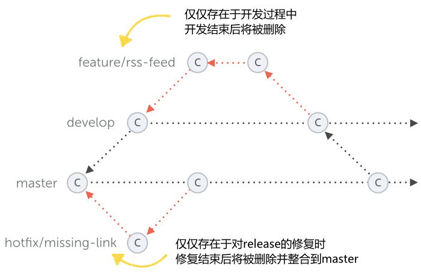

# Git分支策略

## 使用场景

​	一个项目在开发过程中，往往伴随的是**新需求的开发**、**BUG的修改**以及**需求的变动**等等；由**多个开发人员**共同协作完成，不同开发人员处理的工作各不相同，开发的进度（完成时间）更是受各种因素的影响。上线后的项目更明显，**紧急BUG修复** 就和其它开发进度有了明显的冲突；优先级虽然很明确，但是手里的需求刚改写一半；代码的冲突就产生了。

例如: 

1. 开发功能 **注册用户** 
2. 开发功能 **登录**
3. **注册用户**要求提前上线，并且其它功能不开放
4. 所有功能都要能在内部测试
5. 由于这 2 个模块要用一个公共模块 **短信验证**，需要开发一个公用的组件提供使用
6. 上线了**注册用户**后遇到紧急处理的BUG要理解处理

## 分支的优势

​	分支的出现对各种场景下不同的需求变更，热修等代码冲突有妥善的解决办法；同时并行推进多个功能开发，提高开发效率，各个分支在开发过程中，如果某一个分支遇到**需求变更**或者**紧急BUG处理**都不会影响 其它分支的开发，并且能够快速解决遇到的问题，不用担心代码的冲突。

## 分支说明

- **master（main）分支**：仅仅包含最终的产品代码，不可对其进行提交
- **develop 分支**：用于汇总所有已完成的新功能的基础分支（之后被整合入master）
- **common/*分支**：以 **develop**分支建立的子分支，进行公共内容的开发，开发完成后合并在**master**和**develop**分支上并删除
- **feature/*分支**：以 **develop** 分支建立的子分支，进行新功能（新优化）的开发，开发完成后合并在**develop**分支中并删除
- **hotfix/*分支**：以 **master **分支建立的子分支，用于紧急修复BUG的分支，结束后合并在**master**分支中，同样也会合并到 **develop** 分支中，标记BUG完成（issues）然后删除

​	这两个分支被称作为 **长期分支**。它们会存活在项目的整个生命周期中。而其他的分支，例如针对功能的分支，针对发行的分支，仅仅只是临时存在的。它们是根据需要来创建的，当它们完成了自己的任务之后就会被删除掉。

